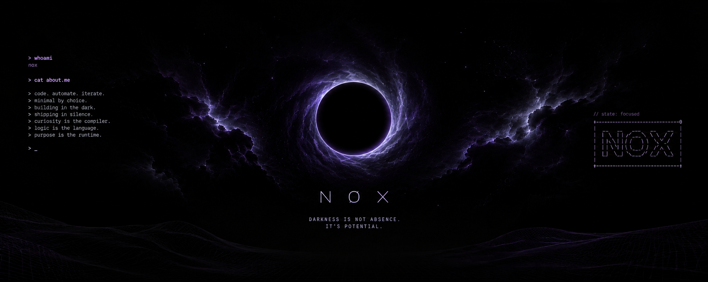
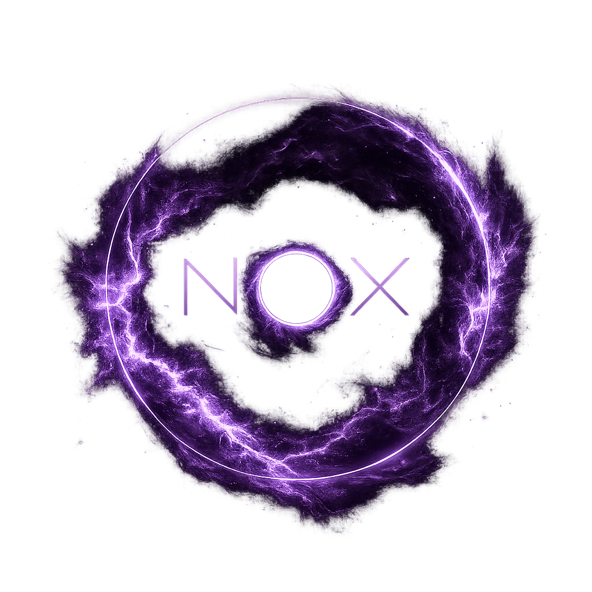

>"Trocamos silêncio por barulho e conexão por distrações, mas nada disso nutre o que está oco por dentro."
---

>I am a software engineering student interested in building reliable, well-structured software. My work sits at the intersection of systems programming, automation, artificial intelligence, and open-source technologies.
>I value continuous learning, clear problem-solving, and practical projects that turn ideas into useful solutions.

---

  

  

---

  

---
<table align="center">
  <tr>
    <td width="20%" align="center">
      
    </td>
    <td width="60%" align="center">
      <strong>Current focus</strong>  
      Building practical software projects and strengthening backend fundamentals. 
      Expanding my knowledge of system architecture and systems programming. 
      Contributing to open source and exploring Linux-based tooling. 
      Developing at the intersection of technology, visual communication, and creative research.
    </td>
    <td width="20%" align="center">
      
    </td>
  </tr>
</table>

---

### Systems & infrastructure

  
  
  
  
  
  

---
#### Development

  
  
  
  
  
  
  
  

---
#### Web & data

  
  
  
  
  

---
#### Toolchain

  
  
  
  
  
  
  
  
  
  

---

> *Keep learning. Keep building.*
